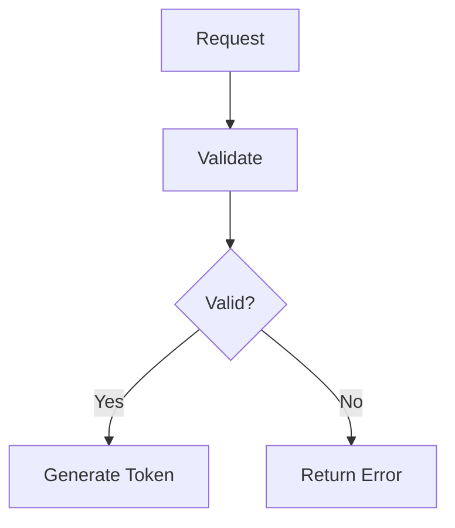

# Codemap

## Executive Summary
Codemap is an AI-powered code visualization system that generates interactive diagrams showing execution flows, data transformations, and architectural patterns within your codebase. It transforms complex code relationships into navigable visual maps with traceable links to source code.

## What It Is and Why It Matters

Codemap provides:

- **Visual Code Flow Maps**: Interactive diagrams showing code execution paths
- **Traceable References**: Direct navigation from diagram elements to source code
- **AI-Generated Insights**: Automatic identification of important patterns and flows
- **Multiple View Formats**: Text diagrams, Mermaid charts, and hierarchical trees

This feature is essential for:
- **Code Understanding**: Grasping complex control flows quickly
- **Architecture Analysis**: Visualizing system design and patterns
- **Onboarding**: Accelerating new developer comprehension
- **Documentation**: Creating visual representations of system behavior

## Key Capabilities

### AI-Powered Map Generation

#### Natural Language Queries
- **Descriptive Input**: Describe the codeflow you want to visualize in plain English
- **Intent Recognition**: AI understands what aspects of the code to highlight
- **Context Awareness**: Leverages project structure and code analysis
- **Targeted Generation**: Focuses on relevant components and flows

#### Multi-Format Output
- **Text Diagrams**: ASCII-based flow representations
- **Mermaid Charts**: Standard diagram format for documentation
- **Hierarchical Trees**: Nested structure views
- **Trace Tables**: Detailed execution step listings

### Interactive Navigation

#### Trace References
- **Clickable Links**: Navigate directly from diagram to source code
- **Line Number Precision**: Jump to exact code locations
- **Bidirectional Traversal**: Move between map and code seamlessly
- **Multi-File Support**: Navigate across related files

#### Expandable Sections
- **Collapsible Traces**: Show/hide detailed execution steps
- **Progressive Disclosure**: Start high-level, drill into details
- **Custom Views**: Focus on specific aspects of the flow
- **Saved Perspectives**: Remember preferred view configurations

### Rich Metadata

#### Trace Guides
- **Step-by-Step Explanations**: Detailed walkthroughs of code execution
- **Markdown Documentation**: Formatted descriptions with examples
- **Code Annotations**: Inline explanations of complex logic
- **Best Practices**: Notes on implementation patterns

#### Diagram Enhancements
- **Status Indicators**: Show execution states and conditions
- **Error Paths**: Highlight exception handling flows
- **Data Transformations**: Track data changes through the flow
- **Performance Notes**: Identify potential bottlenecks

## How It Works Conceptually

### Generation Pipeline

```
┌─────────────────────────────────────────┐
│      User Query                         │
│  "Show how user authentication works"   │
└──────────────┬──────────────────────────┘
               ↓
┌─────────────────────────────────────────┐
│      AI Analysis                        │
│  • Intent Understanding                 │
│  • Context Gathering                    │
│  • Code Pattern Recognition             │
└──────────────┬──────────────────────────┘
               ↓
┌─────────────────────────────────────────┐
│      Trace Extraction                   │
│  • Entry Point Identification           │
│  • Function Call Tracking               │
│  • Data Flow Analysis                   │
└──────────────┬──────────────────────────┘
               ↓
┌─────────────────────────────────────────┐
│      Diagram Generation                 │
│  • Layout Calculation                   │
│  • Reference Resolution                 │
│  • Metadata Attachment                  │
└──────────────┬──────────────────────────┘
               ↓
┌─────────────────────────────────────────┐
│      Interactive Display                │
│  • Rendered Visualization               │
│  • Clickable Navigation                 │
│  • Expandable Details                   │
└─────────────────────────────────────────┘
```

### Trace Resolution

1. **Pattern Matching**
   - Identify function calls and class references
   - Map import statements to file locations
   - Resolve relative paths to absolute locations

2. **Location Resolution**
   - Parse trace references (e.g., [1a], [2c])
   - Map to specific files and line numbers
   - Handle cross-references between traces

3. **Link Generation**
   - Create clickable references in UI
   - Support navigation across files
   - Maintain trace context during navigation

### Diagram Types

#### Text Diagrams
```
[1] Authentication Request
    ├─ [1a] Validate credentials
    ├─ [1b] Check user status
    └─ [1c] Generate token
```

#### Mermaid Flowcharts


#### Hierarchical Trees
- Nested structure representation
- Parent-child relationships
- Depth-based indentation

## Use Cases

### 1. Understanding Authentication Flow
**Query**: "Show how user authentication works"

**Result**:
- Visual map from login endpoint to token generation
- All validation steps and error handling
- Database queries and cache checks
- Session management flows

**Benefits**:
- Quick understanding of security implementation
- Identify potential vulnerabilities
- Debug authentication issues
- Plan security enhancements

### 2. Tracing Data Processing
**Query**: "How is payment data processed?"

**Result**:
- Flow from API endpoint to database
- Validation and sanitization steps
- Third-party service integrations
- Error handling and retry logic

**Benefits**:
- Compliance verification
- Performance optimization
- Error root cause analysis
- Integration point identification

### 3. API Endpoint Analysis
**Query**: "Show the order creation API flow"

**Result**:
- Request validation sequence
- Business logic execution
- Database operations
- Response generation
- Side effects (notifications, emails)

**Benefits**:
- Impact analysis for changes
- Test case planning
- Documentation generation
- Performance profiling

### 4. Debugging Complex Issues
**Query**: "Why does the checkout fail intermittently?"

**Result**:
- All possible execution paths
- Conditional branches
- External dependencies
- Error propagation paths

**Benefits**:
- Identify race conditions
- Find edge cases
- Understand failure modes
- Plan comprehensive fixes

## Integration Points

### With Code Editor
- Navigate from codemap to source code
- Highlight relevant code sections
- Show execution context in editor
- Support inline codemap references

### With Project Structure
- Use architectural context for better maps
- Leverage package boundaries
- Understand service dependencies
- Map cross-service flows

### With Context Assembly
- Include codemap traces in AI context
- Provide visual explanations to agents
- Enhance code comprehension
- Support architectural reasoning

## Codemap Metadata Structure

### Core Elements
- **Title**: Descriptive name for the codemap
- **Description**: High-level explanation of the flow
- **Query**: Original user request
- **Status**: Generation state (creating, done, error)

### Traces
- **ID**: Unique identifier for each trace
- **Title**: Name of the traced component
- **Description**: Detailed explanation
- **Trace Text Diagram**: ASCII representation
- **Trace Guide**: Markdown documentation
- **Locations**: Clickable references to code

### Diagram Data
- **Mermaid Diagram**: Standard diagram syntax
- **Layout Information**: Position and sizing
- **Style Attributes**: Visual formatting
- **Interactivity**: Click regions and actions

## Best Practices

### Query Formulation
- **Be Specific**: Focus on particular aspects or components
- **Use Context**: Mention relevant modules or features
- **Describe Intent**: Explain what you want to understand
- **Iterate**: Refine queries based on results

### Map Interpretation
- **Start High-Level**: Begin with overview traces
- **Follow References**: Click through to understand details
- **Read Guides**: Consult trace guides for explanations
- **Cross-Reference**: Compare with actual code

### Sharing and Documentation
- **Save Useful Maps**: Keep generated maps for reference
- **Add to Documentation**: Include in project docs
- **Share with Team**: Distribute for collective understanding
- **Update Regularly**: Regenerate as code evolves

## Advanced Features

### List View Management
- Browse all generated codemaps
- Search and filter by query or title
- Track generation status
- Delete outdated maps

### Agent Assignment
- Designate specific agents for codemap generation
- Configure generation parameters
- Set quality and detail preferences
- Manage generation queue

### Persistent Storage
- Save maps to project files
- Version control compatibility
- Export to standard formats
- Import external diagrams

## Related Concepts

- **[Project Structure](knowledge-management/project-structure.md)**: Architectural context for codeflows
- **[Code Editor](development-tools/code-editor.md)**: Direct code navigation and viewing
- **[Context Assembly](context-assembly/context-assembly.md)**: Providing AI with code context
- **[Documentation](development-tools/documentation.md)**: Project documentation systems
